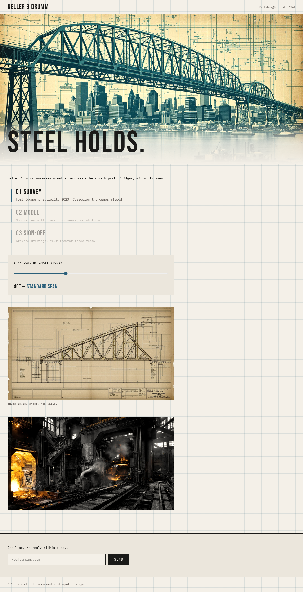
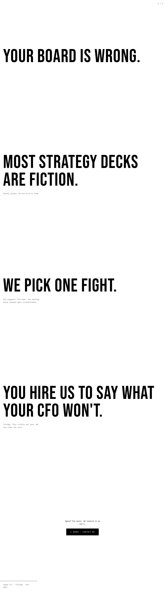
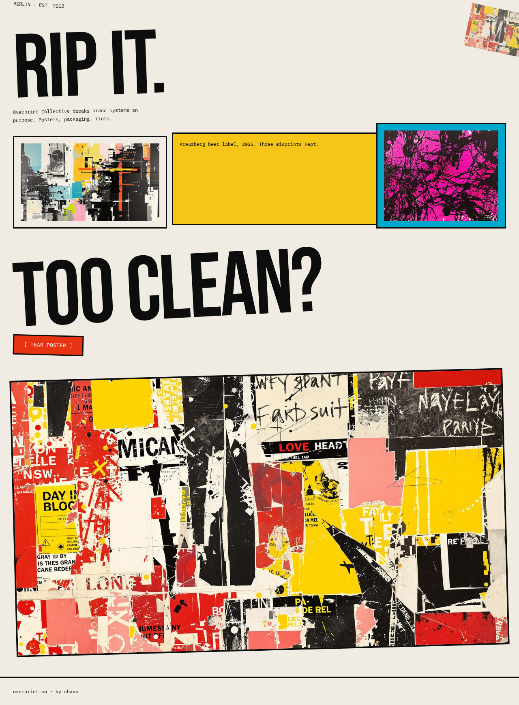
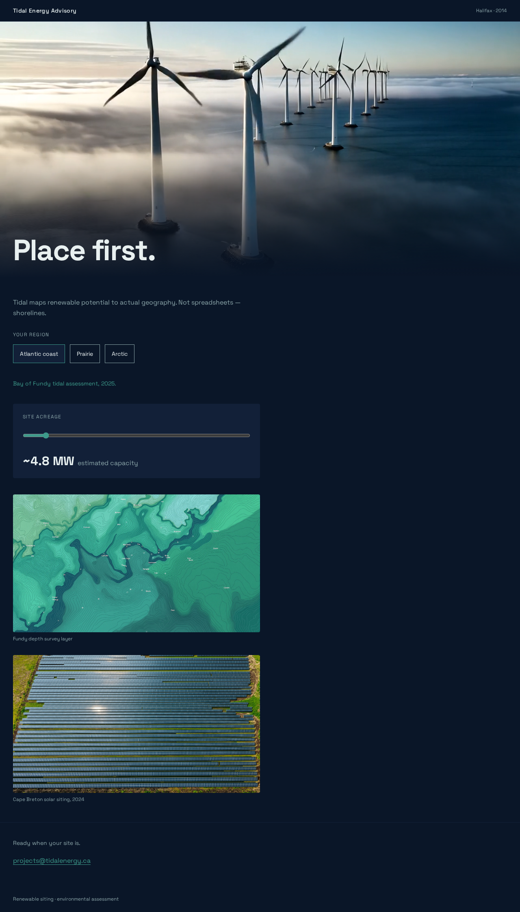
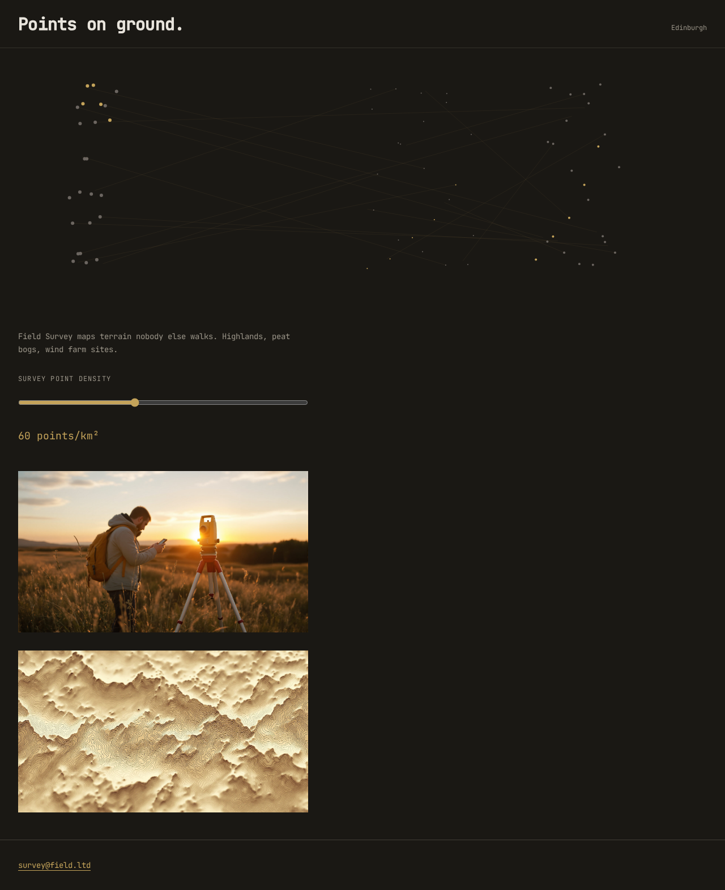

## Summary

Expanded gallery to **ten fictional consulting firms** across three poles Ro named: receipt/terminal, severe minimal, and chaotic/experimental. Mercury (safe-middle editorial) removed; Ledger Terminal rebuilds the receipt aesthetic he liked with proper copy and real b&w imagery.

Live at **https://redesign.0xbeckett.me**

## Pole distribution

| Pole | Count | Routes |
|------|-------|--------|
| Receipt / terminal | 1 | `/1` |
| Severe minimal | 4 | `/2`–`/5` |
| Chaotic / experimental | 5 | `/6`–`/10` |

---

### /1 — Ledger Terminal (Receipt · Rotterdam)

**Design idea:** Dot-matrix receipt paper, monospace `[labels]`, ruled lines, dashed borders, b&w port photography.

**Fogg:** Reduction (one `[FILE MANIFEST]` button), Self-monitoring (live filings table), Tunneling (§001→§003 sequence), Conditioning (manifest confirmation state)

**Body copy:** 52 words

---

### /2 — Blackwell (Minimal · London)

**Design idea:** Print-magazine editorial, grayscale photography, single phone CTA.

**Fogg:** Surveillance (live reader count), Tunneling (scroll step indicator), Reduction (one phone number)

**Body copy:** 45 words

---

### /3 — Halt Bureau (Minimal · Zurich)

**Design idea:** One Helvetica weight, extreme whitespace, pause-button interaction.

**Fogg:** Reduction (single pause action), Conditioning (button state flip), Suggestion (CTA after context)

**Body copy:** 38 words

---

### /4 — Omission (Minimal · New York)

**Design idea:** Typography and margins only — gallery-wall restraint, serif headline as structure.

**Fogg:** Reduction (one email), Tunneling (vertical read path), Tailoring (deletion framing)

**Body copy:** 32 words

---

### /5 — Veld (Minimal · Utrecht)

**Design idea:** Flat Dutch horizons, italic Garamond, images separated by vast whitespace.

**Fogg:** Suggestion (email at end of scroll), Reduction (no form), Tailoring (land-use sector implied)

**Body copy:** 20 words

---

### /6 — Keller & Drumm (Chaotic · Pittsburgh)

**Design idea:** Blueprint grid overlay, engineering-drawing chaos, load slider.

**Fogg:** Tunneling (phase scroll), Self-monitoring (tonnage slider), Reduction (one email)

**Body copy:** 58 words

---

### /7 — Argue LLC (Chaotic · Chicago)

**Design idea:** Full-viewport scroll argument, Bebas Neue, theatrical stamp.

**Fogg:** Tunneling (scroll sections), Conditioning (agree stamp), Reduction (one button)

**Body copy:** 37 words

---

### /8 — Overprint Collective (Chaotic · Berlin)

**Design idea:** Broken grid, misregistered CMYK layers, risograph noise, torn poster collage.

**Fogg:** Conditioning (`[ TEAR POSTER ]` state change), Suggestion (CTA after chaos reveal), Self-monitoring (headline flip)

**Body copy:** 17 words

---

### /9 — Tidal Energy Advisory (Chaotic · Halifax)

**Design idea:** Generated wind-farm video hero, coastal maps, live MW calculator.

**Fogg:** Tailoring (region selector), Self-monitoring (acreage→MW), Suggestion (email after calculator)

**Body copy:** 52 words

**Video:** `fal-ai/minimax/video-01` — `public/assets/tidal/wind.mp4`

---

### /10 — Field Survey Ltd (Chaotic · Edinburgh)

**Design idea:** Canvas particle field (WebGL), topographic imagery, density slider.

**Fogg:** Self-monitoring (live point density), Surveillance (animated field), Reduction (one email)

**Body copy:** 14 words

---

## Picker

Grouped by pole — receipt, minimal, chaotic.

## Assets

- 38+ generated images (fal-ai/flux-pro/v1.1-ultra), 3+ per page
- 1 generated video (fal-ai/minimax/video-01) on Tidal (/9)
- WebGL canvas on Field Survey (/10) with static fallback for reduced-motion

## Verification

- [x] Routes `/picker` and `/1`–`/10` return 200
- [x] No horizontal overflow at 375px on any route
- [x] Hero ≤ 8 words, body ≤ 150 words, zero banned words
- [x] No Beckett/AI references
- [x] `prefers-reduced-motion` respected

## Test plan

- [ ] Picker shows three pole groups with ten distinct thumbnails
- [ ] `/1` receipt: monospace, brackets, ruled lines, b&w only
- [ ] `/2`–`/5` feel severely restrained — not brochure-template
- [ ] `/6`–`/10` feel experimental — not reskins of minimal pages
- [ ] Tidal video plays; Field canvas animates; both degrade with reduced-motion
- [ ] Tab through all ten — focus rings, skip links, 44px targets
